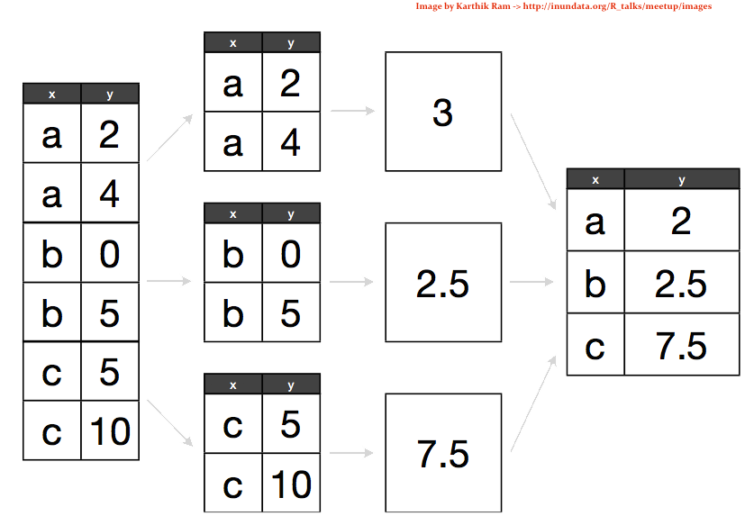

```{r, echo = FALSE}
knitr::opts_chunk$set(
  message = FALSE,
  warning = FALSE,
  collapse = TRUE,
  comment = "#>",
  fig.height = 4,
  fig.width = 8,
  fig.align = "center",
  cache = FALSE
)
```


## Warmups - Problem 1

10 week sensory experiment, 12 individuals assessed taste of french fries on several scales (how potato-y, buttery, grassy, rancid, paint-y do they taste?), fried in one of 3 different oils, replicated twice. First few rows:

```{r, echo=FALSE, results='asis'}
library(tidyr)
library(dplyr)
library(readr)
data(french_fries, package = "reshape2")
knitr::kable(head(french_fries, 4), format = "markdown", row.names = FALSE)
```

What do you want to know?

## Warmups - Problem 2

What's in the column names of this data?

```{r, echo=FALSE, results='asis'}
genes <- read_csv("http://dicook.github.io/Monash-R/data/genes.csv")
knitr::kable(genes)
```

## Warmups - Problem 3

How many ways can you write today's date?

## What we are going to cover today

- Reading different data formats
- Tidying data
- Split - apply - combine
- Pipes
- Joins
- Working with dates
- Splitting strings

## Using the packages tidyr, dplyr

```{r, results='hide'}
library(tidyr)
library(dplyr)
data(french_fries, package = "reshape2")
knitr::kable(head(french_fries), format = "markdown", row.names = FALSE)
```

## French fries - hot chips

10 week sensory experiment, 12 individuals assessed taste of french fries on several scales (how potato-y, buttery, grassy, rancid, paint-y do they taste?), fried in one of 3 different oils, replicated twice. First few rows:


```{r, echo=FALSE, results='asis'}
knitr::kable(head(french_fries), format = "markdown", row.names = FALSE)
```

## What would we like to know?

- Is the design complete?
- Are replicates like each other?
- How do the ratings on the different scales differ?
- Are raters giving different scores on average?
- Do ratings change over the weeks?

Each of these questions involves different summaries of the data.

## What we have and what we want

<div align="center">
  
</div>

## Gathering

- When gathering, you need to specify the **keys** (identifiers) and the **values** (measures).

Keys/Identifiers:
- Identify a record (must be unique)
- Example: Indices on an random variable
- Fixed by design of experiment (known in advance)
- May be single or composite (may have one or more variables)

Values/Measures:
- Collected during the experiment (not known in advance)
- Usually numeric quantities

## Gathering the French Fries

```{r}
library(tidyr)
ff_long <- gather(french_fries, key = variable, value = rating, potato:painty)
head(ff_long)
```

## Long to Wide

In certain applications, we may wish to take a long dataset and convert it to a wide dataset (Perhaps displaying in a table).

This is called "spreading" the data.

## Spread

We use the **spread** function from tidyr to do this:

```{r}
french_fries_wide <- spread(ff_long, key = variable, value = rating)

head(french_fries_wide)
```

## Lets use gather and spread to answer some questions

Easiest question to start is whether the ratings are similar on the different scales, potato'y, buttery, grassy, rancid and painty. 

We need to gather the data into long form, and make plots facetted by the scale. 

## Ratings on the different scales

```{r, fig.height=2, fig.width=8}
library(ggplot2)
ff.m <- french_fries %>% 
  gather(type, rating, -subject, -time, -treatment, -rep)
head(ff.m)
qplot(rating, data=ff.m, binwidth=2) + 
  facet_wrap(~type, ncol=5) 
```

## Side-by-side boxplots

```{r}
qplot(type, rating, data = ff.m, fill = type, geom = "boxplot")
```


## Do the replicates look like each other?

We will start to tackle this by plotting the replicates against each other using a scatterplot. 

We need to gather the data into long form, and then get the replicates spread into separate columns. 

## Check replicates

```{r, fig.show='hold', fig.align='default', fig.height=4, fig.width=4}
head(ff.m)
ff.s <- ff.m %>% spread(rep, rating)
head(ff.s)
```

## Check replicates

```{r, fig.show='hold', fig.align='default', fig.height=3, fig.width=3}
qplot(`1`, `2`, data=ff.s) + theme(aspect.ratio=1) + 
  xlab("Rep 1") + ylab("Rep 2")
qplot(`1`, `2`, data=ff.s) + theme(aspect.ratio=1) + 
  xlab("Rep 1") + ylab("Rep 2") + 
  scale_x_log10() + scale_y_log10()
```

## Your turn


Make the scatterplots of reps against each other separately for scales, and treatment. 

## Your turn


Read in the billboard top 100 music data, which contains N'Sync and Backstreet Boys songs that entered the billboard charts in the year 2000

```{r}
billboard <- read.csv("http://dicook.github.io/Monash-R/data/billboard.csv")
```

What's in this data? What's X1-X76?

## Your turn


1. Use `tidyr` to convert this data into a long format appropriate for plotting a time series (date on the x axis, chart position on the y axis)
2. Use `ggplot2` to create this time series plot:

```{r, echo=FALSE, fig.height=3}
long_billboard <- gather(billboard, key = week, value = rank, X1:X76)
long_billboard$week <- as.numeric(gsub("X", "", long_billboard$week))

qplot(week, rank, data = long_billboard, geom = "line", colour = artist, group = track)
```


## The Split-Apply-Combine Approach

<div align="center">
  
</div>

## Split-Apply-Combine in dplyr

```{r}
library(dplyr)
french_fries_split <- group_by(ff_long, variable) # SPLIT
french_fries_apply <- summarise(french_fries_split, rating = mean(rating, na.rm = TRUE)) # APPLY + COMBINE
french_fries_apply
```

## The pipe operator

- dplyr allows us to chain together these data analysis tasks using the `%>%` (pipe) operator
- `x %>% f(y)` is shorthand for `f(x, y)`
- Example:

```{r}
french_fries %>%
    gather(key = variable, value = rating, potato:painty) %>%
    group_by(variable) %>%
    summarise(rating = mean(rating, na.rm = TRUE))
```

## dplyr verbs
 
There are five primary dplyr **verbs**, representing distinct data analysis tasks:

- Filter: Remove the rows of a data frame, producing subsets
- Arrange: Reorder the rows of a data frame
- Select: Select particular columns of a data frame
- Mutate: Add new columns that are functions of existing columns
- Summarise: Create collapsed summaries of a data frame
    
## Filter

```{r}
french_fries %>%
    filter(subject == 3, time == 1)
```

## Arrange

```{r}
french_fries %>%
    arrange(desc(rancid)) %>%
    head
```

## Select

```{r}
french_fries %>%
    select(time, treatment, subject, rep, potato) %>%
    head
```

## Summarise

```{r}
french_fries %>%
    group_by(time, treatment) %>%
    summarise(mean_rancid = mean(rancid), sd_rancid = sd(rancid))
```

## Let's use these tools to answer the rest of the french fries questions

If the data is complete it should be 12 x 10 x 3 x 2, that is, 6 records for each person. (Assuming that each person rated on all scales.) 

To check this we want to tabulate the number of records for each subject, time and treatment. This means select appropriate columns, tabulate, count and spread it out to give a nice table.

## Check completeness

```{r}
french_fries %>% 
  select(subject, time, treatment) %>% 
  tbl_df() %>% 
  count(subject, time) %>%
  spread(time, n)
```

## Check completeness with different scales, too

```{r}
french_fries %>% 
  gather(type, rating, -subject, -time, -treatment, -rep) %>%
  select(subject, time, treatment, type) %>% 
  tbl_df() %>% 
  count(subject, time) %>%
  spread(time, n)
```

## Change in ratings over weeks, relative to experimental design

```{r}
qplot(time, rating, data=ff.m, colour=treatment) + 
  facet_grid(subject~type) 
```

## Add means over reps, and connect the dots

```{r}
ff.m.av <- ff.m %>% 
  group_by(subject, time, type, treatment) %>%
  summarise(rating=mean(rating))
qplot(time, rating, data=ff.m, colour=treatment) + 
  facet_grid(subject~type) +
  geom_line(data=ff.m.av, aes(group=treatment))
```

## Your turn


Read in the flights data:
```{r}
library(nycflights13)
flights
```

## Your turn


This dataset contains information on over 300,000 flights that departed from New York City in the year 2013.

1. Using dplyr and the pipe operator, create a data frame consisting of the average arrival delay (``arr_delay``) based on the destination airport (``dest``). Sort this data frame in descending order, so the destination airport with the largest delay is first.
2. Find out the most used airports for each airline carrier.

## Dates and Times

Dates are deceptively hard to work with in R.

**Example**: 02/05/2012. Is it February 5th, or May 2nd?

Other things are difficult too:

- Time zones
- POSIXct format in base R is challenging

The **lubridate** package helps tackle some of these issues.

## Basic Lubridate Use

```{r, results='hold'}
library(lubridate)

now()
today()
now() + hours(4)
today() - days(2)
```

## Parsing Dates

```{r, results='hold'}
ymd("2013-05-14")
mdy("05/14/2013")
dmy("14052013")
ymd_hms("2013:05:14 14:50:30", tz = "America/Chicago")
```

## Your turn


1. Using the `flights` data, create a new column Date using lubridate. You will need to paste together the columns year, month, and day in order to do this. See the `paste` function.
2. Use dplyr to calculate the average departure delay for each date.
3. Plot a time series of the date versus the average departure delay

```{r, echo = FALSE, fig.height = 3}
flights$date <- ymd(paste(flights$year, flights$month, flights$day, sep = "-"))
delay.dat <- flights %>% group_by(date) %>% summarise(dep_delay = mean(dep_delay, na.rm = TRUE))

qplot(date, dep_delay, geom = "line", data = delay.dat)
```

## Bioinformatics data - Michelle's example

String manipulation

## TODO

* SQL/JOINS with dplyr and flight data? (Carson)
* dplyr do() + tidyr::unnest() (Carson)
* more with tidyr
* reading different data formats: image, json, audio, xml/html, ncdf, excel/sas/stata, GIS files, (Di)

